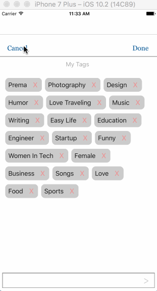
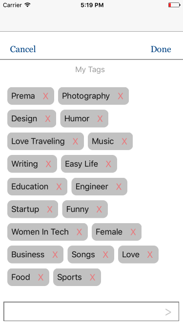

# TagControl
It is a custom tag view. It can add and delete new tags from view.

#####Install Cocoa Pods

If you have already installed Cocoa Pods then you can skip this step.

```
$ [sudo] gem install cocoapods
$ pod setup
```

#####Install `TagControl ` pod
Once Cocoa Pods has been installed, you can add `TagControl ` iOS Component to your project by adding a dependency entry to the Podfile in your project root directory.

```
$ edit Podfile
platform :ios, '9.0'
pod 'TagControl'
```

This sample shows a minimal Podfile that you can use to add `TagControl ` iOS Component dependency to your project. 
You can include any other dependency as required by your project.

Now you can install the dependencies in your project:

```
$ pod install
```

Once you install a pod dependency in your project, make sure to always open the Xcode workspace instead of the project file when building your project:

```
$ open App.xcworkspace
```

Now you can import `TagControl ` in your source files:

Swift

```swift
import TagControl
```

At this point `TagControl ` iOS Component is ready for use in your project.


### TagControl Component Usage Guideline

##### How to import?

***Step 1.*** Go to your `ViewController.swift` & `import TagControl`

***Step 2.*** Go to your `ViewController.swift` & add `TagViewDelegate `

***Step 3.*** Create a variable of type `TagView`

```swift
 var tagView: TagView?

```

##### How to use?
##### Within your ViewController add below code.

###### you can call `self.addTagView()` from anywhere you want like on button tap or viewDidLoad()

```swift
    @IBAction func btnShowTagsTapped(_ sender: Any) {
        self.addTagView()
    } 
```
```swift
 func addTagView() {
        if self.tagView != nil {
            self.tagView?.removeFromSuperview()
            self.tagView = nil
        }
        let contents = self.tagViewContents()
        self.tagView = TagView.initTagView(contents, delegate: self)
        self.view.addSubview(self.tagView!)
        self.tagView?.setupInitialConstraintWRTView(self.view)
    }
```
```swift
     func tagViewContents() -> [String]? {
        var tags = [String]()
        tags = ["Prema", "Photography", "Design", "Humor", "Love Traveling", "Music", "Writing", "Easy Life", "Education", "Engineer", "Startup", "Funny", "Women In Tech", "Female", "Business", "Songs", "Love", "Food", "Sports"]
        return tags
    }
    
```

```swift   
    func removeTagView() {
        if self.tagView != nil {
            self.tagView?.removeFromSuperview()
            self.tagView = nil
        }
    }

```

##### Implement delegate method

```swift
  func didTapDoneButton(selectedTags: [String]) {
        print(selectedTags)
        self.removeTagView()
    }

    func didTapCancelButton() {
       self.removeTagView()
    }    

```
####Here we have tag control :)

   
 
 
 
###ScreenShot -
 
 
 
